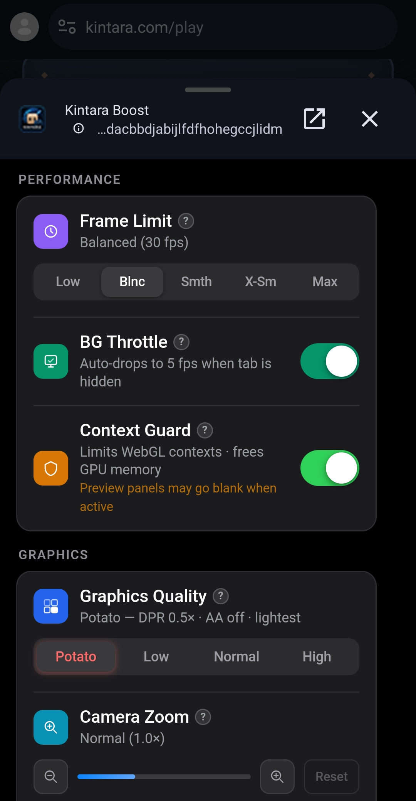

<div align="center">


# Kintara Boost

**Performance optimizer Chrome extension for [kintara.gg](https://kintara.com)**

Lighter · Cooler · Smoother — without touching a single line of game code.

<br/>

> **100% client-side · No data sent to any server · Zero ban risk**

</div>

---

## Preview



---

## Features

### Performance
| Feature | What it does | Live? |
|---|---|---|
| **Frame Limit** | Caps render frames at 20 / 30 / 45 / 60 fps or uncapped | ✅ |
| **BG Throttle** | Auto-drops to 5 fps when you alt-tab or minimize | ✅ |
| **Context Guard** | Keeps WebGL context count ≤ 3 to free GPU memory | ✅ |

### Graphics
| Feature | What it does | Live? |
|---|---|---|
| **Quality Preset** | Sets pixel ratio (DPR) + anti-aliasing in one click (Potato / Low / Normal / High) | 🔄 reload |
| **Camera Zoom** | Zooms the game camera in/out via native scroll events on the canvas | ✅ |
| **Flash Fix** | Removes the blue `#5fa1cf` flash that appears on page load | ✅ |
| **Visual Filter** | Applies color grading to the game: Normal / Vivid / Warm / Cool / Night | ✅ |

### Overlay & Stats
| Feature | What it does | Live? |
|---|---|---|
| **FPS & Ping HUD** | Fixed overlay in top-left showing live FPS + network ping | ✅ |
| **Session Stats** | Tracks active playtime, sessions today, and frames rendered — locally | ✅ |

---

## Installation

1. Download or clone this repository.
2. Open Chrome and go to `chrome://extensions`.
3. Enable **Developer mode** (toggle in the top-right).
4. Click **Load unpacked** and select the `kintara-boost` folder.
5. Open [kintara.gg](https://kintara.gg) or [kintara.com](https://kintara.com) and reload the tab once.
6. Click the extension icon in your toolbar to open the popup.

---

## Is this safe?

**Yes.** Here is exactly what the extension does and doesn't do:

### What it DOES
- Wraps `requestAnimationFrame` to cap the frame rate — a standard browser technique used by many performance tools.
- Reads `document.visibilityState` via the **Page Visibility API** (read-only, built into every browser) to throttle frames when the tab is hidden.
- Injects a `<style>` tag at page start to override the background color (Flash Fix) and apply CSS color filters (Visual Filter).
- Dispatches synthetic `WheelEvent` on the game canvas to trigger the game's own built-in camera zoom handler.
- Intercepts `WebSocket` message timing to measure ping — it **only reads timestamps**, never sends extra traffic or modifies game messages.
- Stores all settings and stats in **`localStorage`** — data never leaves your device.
- Limits WebGL context creation to 3 (Context Guard) using the browser's own `WEBGL_lose_context` API.

### What it does NOT do
- ❌ Read or write game memory
- ❌ Send any data to any external server (including our own)
- ❌ Modify, intercept, or replay game network packets
- ❌ Automate any player action (no bots, no auto-click)
- ❌ Bypass anti-cheat, speed-hack, or alter game logic
- ❌ Access any other website or browser tab

### Permissions explained
| Permission | Why it's needed |
|---|---|
| `storage` | Save your settings between sessions |
| `tabs` | Detect if you're currently on a Kintara tab |
| `scripting` | Apply live setting changes without a page reload |
| `activeTab` | Read the active tab URL to enable/disable the popup |
| `clipboardWrite` | Copy dev Solana donation address with one click |
| `host_permissions` (kintara.gg, kintara.com only) | Limits the extension to only run on Kintara — not on any other site |

All code is plain, unobfuscated JavaScript. You can inspect every file before installing.

---

## Quality Presets

| Preset | Pixel Ratio | Anti-Aliasing | Best for |
|---|---|---|---|
| **Potato** | 0.5× | Off | Very old or low-end devices |
| **Low** | 0.75× | Off | Laptops, integrated graphics |
| **Normal** | 1.0× | On | Balanced — recommended default |
| **High** | Native | On | Dedicated GPU, best visuals |

> Quality preset changes require a **page reload** to take effect (DPR is locked at renderer creation time).

---

## How Camera Zoom works

The Camera Zoom feature dispatches native `WheelEvent` scroll events on the Three.js canvas — the same events produced by your mouse wheel. The game's own camera handler responds to these events exactly as if you had scrolled. No game internals are touched.

- **+** button → zoom in (scroll up on canvas)
- **−** button → zoom out (scroll down on canvas)
- **Reset** → returns to the game's default camera distance
- Quick presets: −40% / −20% / 1× / +25% / +50%

---

## How Session Stats work

Session Stats are stored entirely in `localStorage` (your browser, your device). The data tracked:

- **Active Today** — time the tab was visible today
- **Sessions Today** — how many times you've loaded the game today
- **Frames Drawn** — total render frames counted via `requestAnimationFrame`

Nothing is sent anywhere. You can reset stats at any time from the popup.

---

## File structure

```
kintara-boost/
├── manifest.json      # Extension manifest (MV3)
├── content.js         # Core logic injected into kintara.gg (MAIN world)
├── popup.html         # Extension popup UI
├── popup.js           # Popup logic & settings sync
├── popup.css          # Popup styles
├── background.js      # Service worker (minimal)
└── icon/
    ├── icon16_performance.png
    ├── icon48_performance.png
    └── icon128_performance.png
```

---

## Frequently Asked Questions

**Will this get me banned?**
No. All techniques used are standard browser APIs. The extension never interacts with game logic, modifies packets, or automates any action. It is functionally equivalent to using your browser's built-in DevTools to throttle performance.

**Does it work on mobile browsers?**
Chrome extensions are not supported on mobile Chrome. For desktop Chrome/Chromium only.

**The camera zoom doesn't feel smooth — is that normal?**
Yes. Each step fires one scroll-wheel event on the canvas. The zoom magnitude and easing are controlled entirely by the game's camera handler — the extension just triggers it.

**The popup shows "Not on Kintara" — what does that mean?**
You need to be on `kintara.gg/play` or `kintara.com/play` for the extension to be active. Settings can still be changed and will apply on your next visit.

**Can I use this on other games?**
No. Host permissions are scoped strictly to `kintara.gg` and `kintara.com`. The extension does not load on any other site.

---

<div align="center">

Made for the Kintara community · Not affiliated with the Kintara team

</div>
